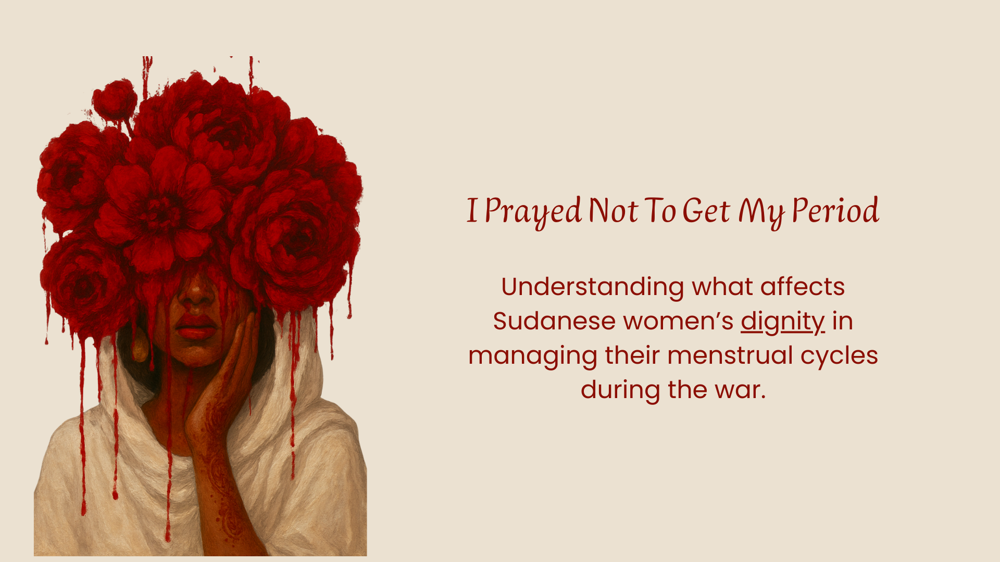

# “I Prayed Not to Get My Period”
## Menstruation and Dignity in Wartime Sudan

This repository explores whether menstrual dignity among Sudanese women has been affected during the ongoing war, and which factors most strongly influence women’s perceptions of dignity while managing their menstrual cycles in displacement and conflict settings.

## Introduction
Menstruation remains a heavily tabooed and stigmatised topic within Sudanese communities. During war, this silence deepens, while women continue to menstruate under increasingly unsafe, undignified, and resource-scarce conditions. Displacement, poverty, lack of privacy, and limited access to menstrual products and hygiene facilities have reshaped how women manage their periods, often at the expense of their physical and mental health.

This project uses data-driven analysis to document these realities and to examine how structural barriers, health outcomes, and access to information intersect with women’s sense of dignity during menstruation in wartime Sudan.

## Project Overview
This project aims to address the lack of data on menstrual health in conflict-affected Sudan by analysing survey data collected from Sudanese women, most of whom are displaced or refugees. The goal is to understand how war-related conditions influence menstrual practices, health outcomes, and perceptions of dignity, and to identify the factors most strongly associated with dignity violations.

This analysis helps reveal not only material barriers such as cost and availability of menstrual products, but also the deeper normalisation of suffering that leads many women to endure harm without naming it as a violation of dignity.

## Research Question
What factors influence whether Sudanese women perceive their menstrual dignity as affected during the war?
.png)

## Goals of the Project
- Document changes in menstrual product use during the war  
- Assess barriers to accessing and managing menstrual health safely  
- Examine the relationship between menstrual health outcomes and perceived dignity  
- Identify key predictors of menstrual dignity using statistical modelling  
- Contribute evidence to support advocacy, awareness, and humanitarian response  

## Methodology
The analysis is based on survey data collected from 151 Sudanese women, 90 percent of whom were displaced or refugees at the time of participation.
.png)
### Data Exploration
Initial exploration focused on participant demographics, displacement status, menstrual product use before and during the war, reported health symptoms, and access barriers related to cost, availability, quality, hygiene, privacy, and disposal.

### Preprocessing
Data cleaning included handling missing values, encoding categorical variables, grouping infection symptoms by severity, and categorising menstrual products by risk level. Variables related to dignity perception were binarised for modelling.

### Model Training
A logistic regression model was trained to examine the association between menstrual dignity and multiple explanatory factors, including:
- Cost, availability, and quality barriers to menstrual products  
- Health status and infection symptoms  
- Access to water, soap, privacy, and safe disposal  
- Housing and displacement conditions  
- Menstrual health education  
- Type of menstrual products used  

The model achieved an AUC of 0.794.

### Explainability Analysis
Model coefficients and statistical significance were examined to understand the strength and direction of associations between predictors and dignity perception.

### Interpretation and Insights
Key findings showed that:
- Quality and usability barriers were strongly associated with dignity violations  
- Women experiencing infection symptoms, especially advanced symptoms, were significantly more likely to report affected dignity  
- Receiving menstrual health education was associated with a higher likelihood of reporting dignity violations, suggesting increased awareness rather than increased harm  

These findings highlight how dignity can be eroded not only through suffering, but through the normalisation of that suffering.

.png)

## Author
Solara Hamza  
Healthcare and data professional  
Founder of No Shame  

## License
You are welcome to use and adapt the code in this repository with proper attribution.
